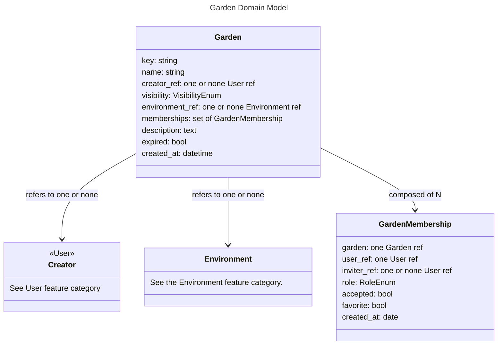

# Garden - Models

# Garden

A Garden is an container model that contextualizes most other models in the application. While a Workspace is a representation of a physical space, a Garden is an environment for multiple Workspaces, a permissions system for multiple Users, and a set of references to CultivarSets.  

## key

A unique string id should be generated for each Garden, mostly for the purposes of URLs.

## name

A Garden's name should be non-unique and able to be changed at any time.

## creator

A Garden should keep track of the User that created it, but have no reliance on this references such that if the creator is deleted, the reference is set to None and nothing changes (provided there are other Users in the Garden).

## visibility

A Garden should be able to have these levels of visibility:
- Private: View permissions and up are restricted to invitees.
- Unlisted: Edit permissions and up are restricted to invitees. Anyone with a link can view, but can't be found with a search.
- Public: Edit permissions and up are restricted to invitees. Anyone with a link can view, and potentially find on the site without a link.

## memberships

Gardens should delete themselves after a set amount of time if they have no admins, editors, or viewers. If all Admins leave, the oldest Edit GardenMembership should be promoted to Admin.

## cultivar_sets

CultivarSets can be connected to a garden, and from there be copied to and from User profiles.

## workspaces

A Garden should have reference to any amount of Workspaces.

# EnvironmentAttributeProfiles

Gardens should be able to define attributes of the physical environment. These should not entirely define the environments that Workspaces represent, but contextualize them and provide a base set of attributes to inherit.

## FrostDateProfile

Frost dates are a widely used heuristic for constructing planting calendars. The EcoTemporalAttributes defined in the Plants feature category use these to define acceptable planting windows.

### first_frost_date

The first frost date is the expected first day in the year to have frost.

### last_frost_date

The last frost date is the expected last day in the year to have frost. 

# GardenMembership

GardenMembership models provide metadata for links between User and Garden models.

## garden

A GardenMembership should refer to only one Garden.

## user

A GardenMembership should refer to only one main User.

## inviter

A GardenMembership should keep track of who created it. If the inviter and the user are the same, the inviter should be None. The deletion of the inviter should be of no consequence to the GardenMembership. 

## role

A GardenMembership should be able to grant these levels of access:
- Admins:
    - Invite viewers, editors, and admins.
    - Demote or revoke editors and viewers.
    - Change the garden name, key_id.
    - Add and remove Workspaces, CultivarSets
    - Manipulate all model state.
- Edit:
    - Invite viewers.
    - Manipulate PlantInstance model state.
    - Update CultivarSets and Workspaces.
- View: 
    - Restricted to read-only.

## favorite

A garden membership should be able to be marked as a favorite, so it can show up at the top of the Gardens menu